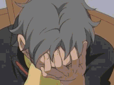

# DOP: From Houdini to Unreal | Unity, The Easy Way[s]


上周[玩了下 DOP network](https://zhuanlan.zhihu.com/p/53188002)

得到了这么一个动画 // 1800帧，310个骨牌


那么想在游戏引擎里面实时渲染之前的模拟结果的话 —— 怎么办？


## The Naive Way

最最简单的办法：直接导出顶点动画

alembic 是个不错的格式，就是实时渲染中每帧更新那么多顶点数据实在过意不去

所以这一节略，毕竟没啥值得说的

总之，上周这个动画渲染成 alembic 格式大概要 467MB，虽然能用又方便，但不到万不得已还是别这么玩比较好


## To Skinned Mesh!

### Direct FBX Output

骨骼动画是用骨骼驱动顶点的一种设计，通过适当的抽象，信息密度可以比顶点动画高很多，相信这里不用对这么基础的概念做过多解释，简而言之：至少目前而言，蒙皮+骨骼动画乃是实时渲染领域的正道

那么试试看吧，首先 Houdini 自己有输出 fbx 的功能，进入 /out 网络，添加 filmboxfbx 节点，试试：


=>


得到一份 173KB 的 FBX 以及一份 223MB 的 FPC(Geometry Cache)，果然被当做顶点动画对待了


### RBD To FBX

换一条路，Houdini Game Tools 里面非常贴心的准备了 rbd to fbx 功能：

[GAME TOOLS | RBD TO FBX](https://www.sidefx.com/tutorials/game-tools-rbd-to-fbx/)

emmmmm .... 看样子要等一等


emmmmmmmmmmmmmm ....


emmmmmmmmmmmmmmmmmm ....




emmmmmmmmmmmmmmmmmmmmmmmmmmmmmm .....


┬─┬ノ( º _ ºノ)

终于在大约36分钟之后，导出完成了 ……

导出的 fbx 大约 106MB，能用

能用是能用，有没有更好的方法呢


### Skinning Converter

我们试试再换一条路，Houdini 非常贴心地准备了 skinning converter 功能，自动将顶点动画转换为蒙皮动画：

[GAME TOOLS | SKINNING CONVERTER](https://www.sidefx.com/tutorials/game-tools-skinning-converter/)

给它个机会：


看上去离成功只有一步之遥了，但是哪有这等好事：


### 求人不如求己

总之(在我看来)官方提供的途径都有点遗憾，直接导出是顶点动画，rbd to fbx 太慢，skinning converter 不是这么用的；所以干脆自己重新造个轮子吧，编程的乐趣不就在这儿吗

#### rbd to fbx?

看看 rbd to fbx 是如何实现的： [rop_rbd_to_fbx/PythonModule](https://github.com/sideeffects/GameDevelopmentToolset/blob/Development/otls/rop_rbd_to_fbx.hda/gamedev_8_8Driver_1rop__rbd__to__fbx/PythonModule)

为了清楚点看到它的工作原理，首先把它输出之后的 cleanup 操作禁用掉，然后改一下输出时间范围再导出一次(少导出几帧，避免再等 40 分钟 ...)


接下来在 /out/rop_rbd_to_fbx/Export/FBX_EXPORT/TRANSFORM_NODE 路径下面可以看到这样的景象：


很明显，rbd to fbx 是把想要导出的那个物件拆成了 N 份 Geometry，每个骨牌的运动被重新表示成了各自 Geometry 的动画

若是在祖传 In-house engine 或是 Unity 那儿，美术这么干可能会被程序打的 */\*好在我是程序，没人能打我\*/* —— 这样的结构每个 Geometry 需要用一个 draw call 绘制


// Unity 空场景空跑

->


// Unity 添加一份 `rbd to fbx` 导出模型

好在 Unreal 足够聪明，fbx 导入之后自动转换成了 skinned mesh，在 Unreal 的世界这样做实际上是可以接受的

#### skinning converter

另一边，再看看 skinning converter 是怎么实现的： [sop_skinning_converter/PythonModule](https://github.com/sideeffects/GameDevelopmentToolset/blob/Development/otls/sop_skinning_converter.hda/gamedev_8_8Sop_1sop__skinning__converter/PythonModule)

似乎 skinning converter 的思路更加简单清晰：在 skinning converter 内部用 OUT_ANIMATEDPOINTS 当作骨骼节点，点上的 xform 属性记录了每根骨骼每个时刻的变换矩阵，根据这些点上的信息便可以自动创建骨骼、记录关键帧了；然后 blah blah ... 别的都不太用得上

看起来并不难，干脆自己实现一个比 `rbd to fbx` 可靠更高效、比 `skinning converter` 简单好用的 rbd skinning converter 罢

#### DIY

把 bullet 模拟的结果表示为骨骼动画实际上挺简单的：

首先动态部分我们是用 rbd packed object 导入的，这意味着实际上每一个运动的部件都是个 [packed geometry](http://www.sidefx.com/docs/houdini/model/packed.html), 也就是说，各自的运动由一个点来驱动 —— 这个点不就正适合作为骨骼吗

然后，把这个点 unpack 还原，得到的 geometry 正好也知道它应该蒙到哪根对应的骨骼上了

再然后，bullet 模拟出来的点上不但有位置属性(`@P`)、有朝向属性(`@orient`)，还有是否处于休止状态的 `@bullet_sleeping` 属性，正好可以过滤掉无用的关键帧

简直完美！

所以，自己干吧：

先新建 subnetwork，随便连一下：


其中 convert_to_skinned_mesh 是个 null 节点，上面手动添加了一个 python 输入框(code)和一个按钮(`exec hou.pwd().parm('code').eval()`)，手动触发的感受比较舒适

enumerate 用于在每个骨骼点上记一个 index，在 unpack 的地方把 index attribute 转移到对应的顶点上，这样每个点就知道自己应该蒙在哪根骨骼上了

然后撸代码：

先生成骨骼 */\*从 skinning converter 那边抄点过来\*/*：

```python
def GenerateSkeletonAndBake(a_Container, a_Subnet, a_RootBone, a_StartFrame, a_EndFrame):
  BoneList = []

  print "Generating Skeleton..."
  for point in hou.node(a_Container.path()+"/OUT_ANIMATEDPOINTS").geometry().points():
    CaptureRadius = point.attribValue("BoneRadius")
    Bone = a_Subnet.createNode("bone")
    Bone.setName(point.attribValue("name"))
    Bone.parm("rOrd").set(0)
    Bone.parm("length").set(0.1)
    Bone.parm("captposelen").set(0.1)

    for parm in ['crtopcapx', 'crtopcapy', 'crtopcapz', 'crbotcapx', 'crbotcapy', 'crbotcapz']:
      Bone.parm(parm).set(CaptureRadius)

    Bone.setNextInput(a_RootBone)
    Bone.moveToGoodPosition()
    BoneList.append(Bone)
```

然后把从 `xform` 属性提取 Translate 和 Rotation 的逻辑给魔改一番：

```python
      # 前略
      for i, Bone in enumerate(BoneList):
        sleeping = AnimGeometry[i].attribValue('bullet_sleeping')
        orient = hou.Quaternion(AnimGeometry[i].attribValue('orient'))
        pos = hou.Vector3(AnimGeometry[i].attribValue('P'))
        if sleeping==1:
          continue
        Translate = pos
        Rotation = orient.extractEulerRotates()

        for i, parm in enumerate(['tx', 'ty', 'tz']):
          SetKeyFrame(Bone.parm(parm), F, Translate[i])
        for i, parm in enumerate(['rx', 'ry', 'rz']):
          SetKeyFrame(Bone.parm(parm), F, Rotation[i])
```


骨骼生成好了:


那么蒙皮怎么办 —— 我们看看使用 skinning converter 生成的 geo1 是个怎么回事：


唔 ... 连了一堆神奇的自动蒙皮装置

然而我们不需要，我们已经知道哪个顶点对应的是哪根骨骼了

那要如何去写入这个信息呢

先到 geometry spreadsheet 里面找找看蒙皮信息是如何记录的吧 ——


大概是这么个东西，懵了，这是啥，怎么改，orz

好在有 capture attribute unpack 这么个好东西，unpack 了之后我们再看看：


这下骨骼编号以及对应的权重就一目了然了

所以我们可以在 capture attribute unpack 下面加上一个 attribute wrangle，自己设一下 index 和 data:

```
i[]@boneCapture_index = array(i@index);
f[]@boneCapture_data = array(1.0);
```

然后再用 capture attribute pack 还原回去：


LOOKS GOOD.

剩下的事情就是把这段连接关系用 python 自动生成出来:

```python
  ObjMerge = Geometry.createNode("object_merge")
  ObjMerge.parm("objpath1").set(ThisNode.parent().path()+"/OUT_GEO")
  ObjMerge.parm("xformtype").set("local")

  TimeShift = Geometry.createNode("timeshift")
  TimeShift.parm("frame").deleteAllKeyframes()
  TimeShift.parm("frame").set(FrameRange[0])
  TimeShift.setNextInput(ObjMerge)
  TimeShift.moveToGoodPosition()
  
  CaptureNode = Geometry.createNode("capture")
  CaptureNode.setNextInput(TimeShift)
  CaptureNode.parm("rootpath").set(Root.path())
  CaptureNode.moveToGoodPosition()
  
  UnpackNode = Geometry.createNode("captureattribunpack")
  UnpackNode.setNextInput(CaptureNode)
  UnpackNode.moveToGoodPosition()
  
  WrangleNode = Geometry.createNode("attribwrangle")
  WrangleNode.setNextInput(UnpackNode)
  WrangleNode.parm("snippet").set('''
  i[]@boneCapture_index = array(i@index);
  f[]@boneCapture_data = array(1.0);
  ''')
  WrangleNode.moveToGoodPosition()
  
  PackNode = Geometry.createNode("captureattribpack")
  PackNode.setNextInput(WrangleNode)
  PackNode.moveToGoodPosition()
  
  Deform = Geometry.createNode("deform")
  Deform.setNextInput(PackNode)
  Deform.parm("donormal").set(1)
  Deform.parm("fast").set(1)
  Deform.moveToGoodPosition()

  Deform.setDisplayFlag(True)
  Deform.setRenderFlag(True)
```

导出，完成！

这下哪怕 Unity 也能开心的渲染了：


而且 Draw Call 数量感人 ——


fracture 自然也不是问题：


存一个 hda，完结！散花！


Update:

忘了总结：比官方所有的版本导出速度快(2.2min)、导出体积小(36MB)、运行代价小，这个轮子没白造。

