用 Houdini+OpenCL 玩命
=================

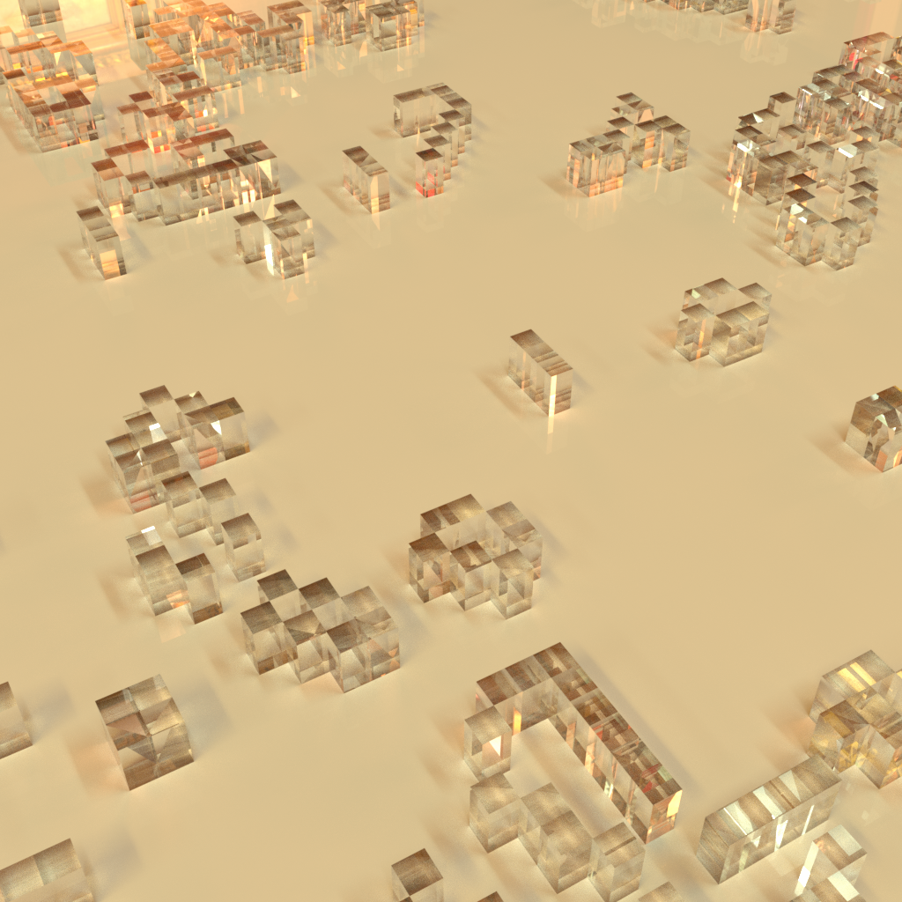


这里的 "命" 当然是指[生命游戏](https://en.wikipedia.org/wiki/Conway%27s_Game_of_Life)啦！

这次的目标是玩玩 Solver，Volume 和 OpenCL

最终得到的结果大概如下图：

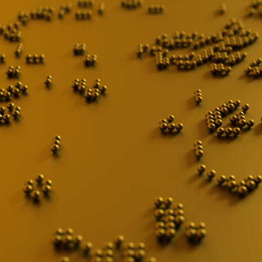

话不多说直接干：

## Volume

先放个 volume，取名 life，x、y 方向大小随意，z 方向大小为 1，div size 取 1 */\*每 1x1x1 单位一个体素\*/*：

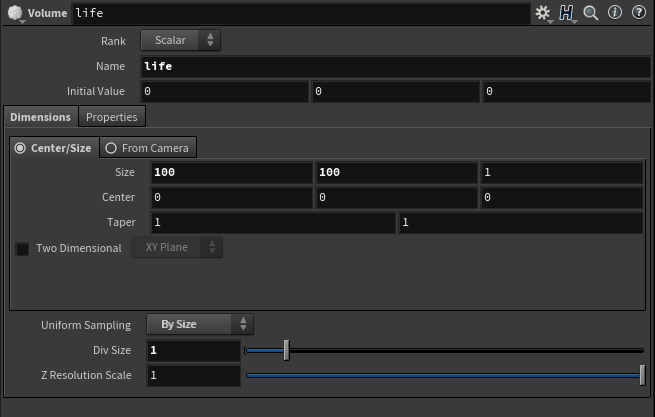

Houdini volume 有多种渲染方式，有很多应用场景，但究其本质其实就是个 3D float 数组，大小你定，名字你取，这里这个 life volume 就是个 100x100x1 的 float 数组

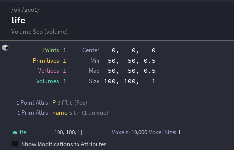

若这个 life 是 vector 类型呢，那就会分为 x,y,z 三个 volume，简单直接:

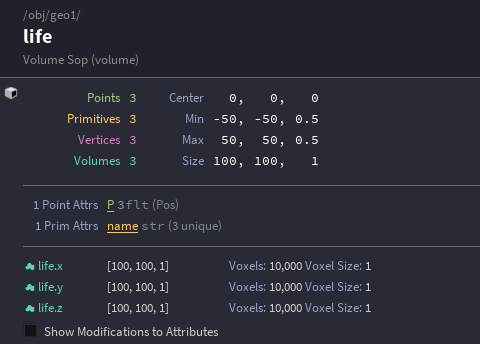

—— 这连续紧凑的数据类型实在是对 GPU 太友好了

Houdini 自带了一堆 Volume 处理方法：

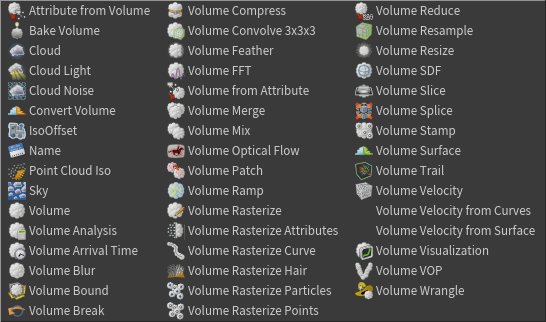

另外还有个强得很的 OpenCL 节点没列在这儿

Volume 的用途实在是太广了，从它的性质也能看出来，数组能干啥 —— 哪数得清！随便举个栗子，Houdini 做爆炸烟雾，用一个 volume 存浓度场，一个 volume 存温度场，一个 volume 存速度场，等等等等 ... 组合起来配合上牛逼的算法就算出了看上去特别真实的火焰

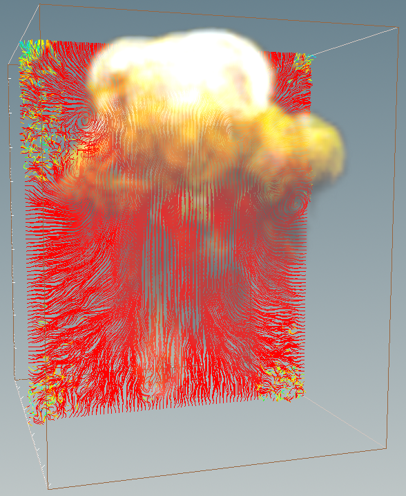

嗯扯远了拉回来，我们这里建立的 life volume 表示的便是生命游戏的 2D 世界

下面接一个 volume vop 用大概 `(sign(noise(@P).x)+1)/2` 这样的思路得到取值 0 或者 1 的噪音

再连一个 volume visualization，在 diffuse field 字段中填入 life 属性，随便设一下 ramp，就能看出个大概了：

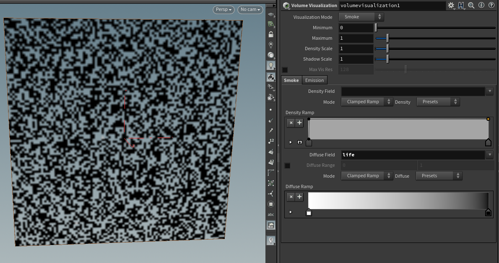

这个，将是我们的初始状态，由于 Volume 的类型选了 smoke，取值 0 的地方自动就透掉了，由它去吧

—— 当然机智的你可以直接读一个位图进来作为初始状态

我们另外建一个 volume 用来记每个点周围存活的邻居数量，大小和 life volume 保持一致，取名 neighbourcount，简称 nc：

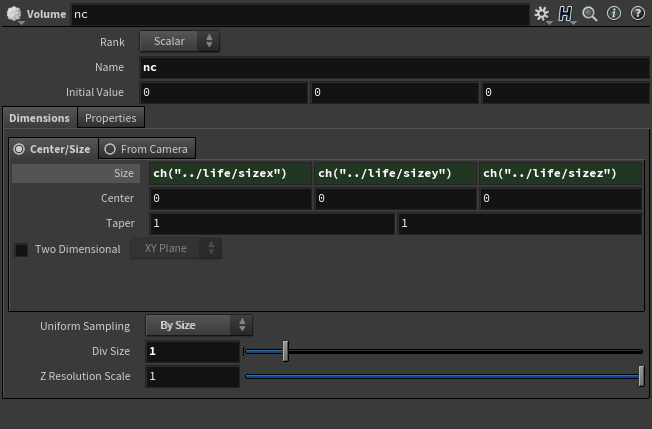

和 life merge 到一起，我们得到了一个含有 life 和 nc 两个 volume 的 Geometry:

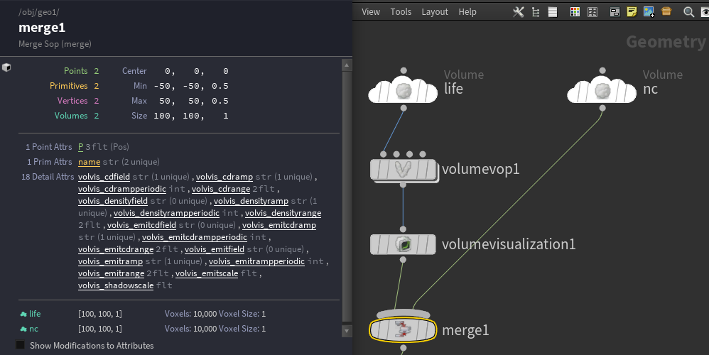

同时很有趣地我们发现，volume visualization 所做的事情不只是显示一下 volume，而是在 detail attribute 里面记录下了这个 volume 应该如何显示，这可帮了我们大忙，后面不用操心这件事了。

## Solver

准备工作做好了，我们在 merge 下面连一个 Solver

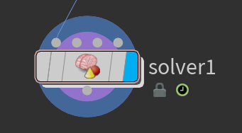

Solver 又是个新奇玩意，直译叫解算器，因为它可以用来做解算，而且这漂亮的图标也暗示了它的聪明劲儿

但从原理上来说，其实叫它迭代器似乎更恰当，这家伙的特点是可以把上一帧自己输出的结果拿进来用，达成迭代的效果：

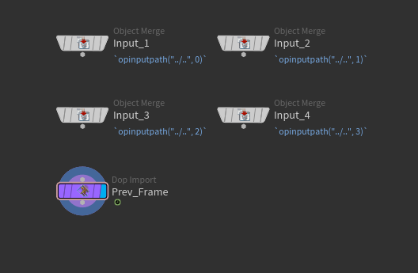

对于生命游戏，拿到上一帧的结果，算一下每个 cell 周围的幸存者数量，然后根据游戏规则 ——

> 生命游戏中，对于任意细胞，规则如下：
> 每个细胞有两种状态 - 存活或死亡，每个细胞与以自身为中心的周围八格细胞产生互动（如图，黑色为存活，白色为死亡）
>
> * 当前细胞为存活状态时，当周围的存活细胞低于2个时（不包含2个），该细胞变成死亡状态。（模拟生命数量稀少）
> * 当前细胞为存活状态时，当周围有2个或3个存活细胞时，该细胞保持原样。
> * 当前细胞为存活状态时，当周围有超过3个存活细胞时，该细胞变成死亡状态。（模拟生命数量过多）
> * 当前细胞为死亡状态时，当周围有3个存活细胞时，该细胞变成存活状态。（模拟繁殖）
>
> 可以把最初的细胞结构定义为种子，当所有在种子中的细胞同时被以上规则处理后，可以得到第一代细胞图。按规则继续处理当前的细胞图，可以得到下一代的细胞图，周而复始。

—— 重新决定一下每个 cell 的死活，就行了

我们先添加一个 volume wrangle，写上 `@nc=@life` 重置 nc，接下来连上一个 volume convovle 用卷积算邻居数：

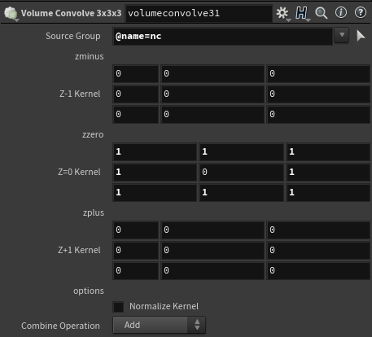

再然后，加一个 OpenCL 节点：

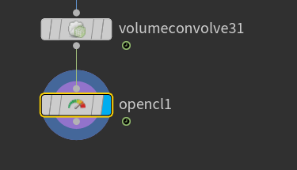

选中 opencl 节点，属性界面先翻到 options 标签页，*Run Over* 选择 *First Writeable Volume*，顾名思义

然后到 bindings 标签页，参数数量填 2

一个参数填 nc，一个参数填 life，并设置好对应的属性：

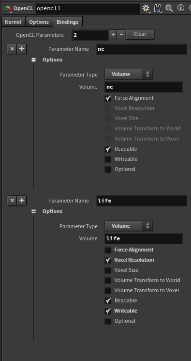

回到 kernel 标签，勾上 *use code snippet* 选项框，一个代码输入框将会出现

别慌，这个时候先点一下 generate kernel，Houdini 会帮你把基础的代码生成好：

```opencl
#include "interpolate.h" 
float lerpConstant( constant float * in, int size, float pos);

kernel void life_game( 
                 global float * nc ,
                 int life_stride_x, 
                 int life_stride_y, 
                 int life_stride_z, 
                 int life_stride_offset, 
                 int life_res_x, 
                 int life_res_y, 
                 int life_res_z, 
                 global float * life 
)
{
    int gidx = get_global_id(0);
    int gidy = get_global_id(1);
    int gidz = get_global_id(2);
    int idx = life_stride_offset + life_stride_x * gidx
                               + life_stride_y * gidy
                               + life_stride_z * gidz;

}
```

把这段代码拷贝、手动粘贴到代码框中，然后根据生命游戏的规则随便改一改：// 注意浮点误差，别用 `==` 比较

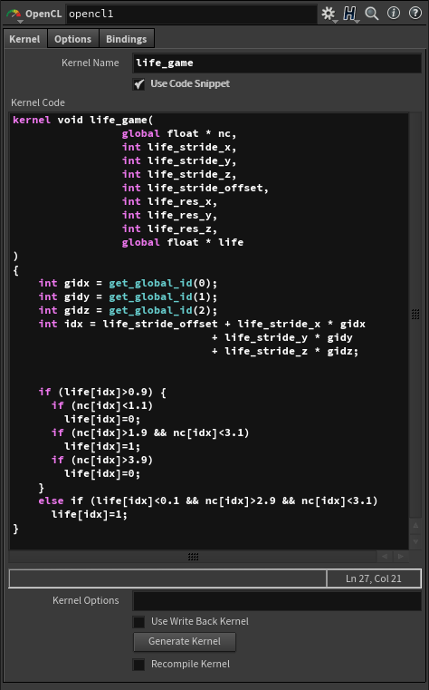

就大功告成了！

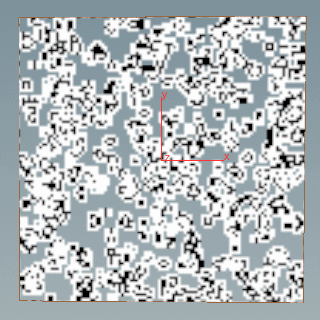

*// 白色没全透的部分是取值接近 0 的浮点误差，不碍事*

如果嫌丑，可以加个 volume wrangle 在有生命的 cell 上面加一个点：

```vex
if (@life>=0.9)
  addpoint(0, @P);
```

然后再 copy 一些 fancy 的东西到那堆点上 ... 随便发挥啦

就！这！么！简！单！

## 总结一下

* 玩了下 Volume
* 玩了下 Solver
* 用 Volume Vop / Volume Wrangle / Volume Convolve / OpenCL 四种方式折腾了 Volume

（完）
