# 假日 Project：用 Houdini 渲染 …… 矢量图？


*本文包含大量 svg 图案，为获得完整阅读体验请前往 TODO*

## 初心

做了几个 HDA 之后，感觉画 svg 图标这事很烦，不画呢又对不起自己的审美追求，如果能直接截个图当作图标就好了

—— or, can we?

## Houdini to SVG

Houdini 的 primitive 有 Face/PackedPrim/Quadric/Surface/VDB/Volume 这么几种，为了偷懒，咱只管 Face 这一种吧 // 哦对了，polyline 也是 face

如何把多边形输出成 svg 呢？

svg 碰巧本来就有 [&lt;polygon&gt; 标签](https://developer.mozilla.org/en-US/docs/Web/SVG/Element/polygon)：

```svg
<polygon points="x1,y1 x2,y2 x3,y3 ..." />
```

于是简单了，做一下 view 和 projection 变换，再转到 screen space，这过程(可以)和光栅化渲染一毛一样——

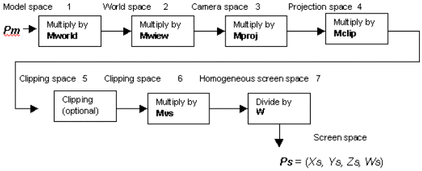

然后把 x,y 坐标给输出出来就完事了

基本思路确定了，那就开干吧


## Basic Setup

先说最后想做成什么样 ——

大概就是想弄出一种新的相机，可以直接输出 svg


至于光照，就在 geometry 层级用[这个 ramp 操作](https://zhuanlan.zhihu.com/p/79744374)算一算 dot(@N, lightdir) 就得了（或者也可以随便演绎）

对了所以记得要关闭光照预览

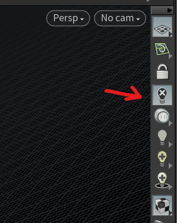

回到相机，先在 camera node 里面新建个 grid 作为感光器，后面会用到

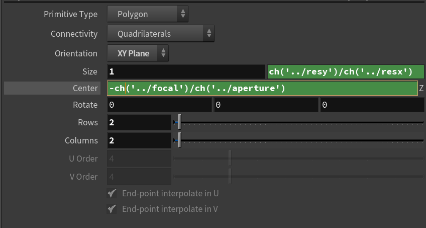

BTW [上次](https://zhuanlan.zhihu.com/p/69301910) 还没弄明白 Houdini 的光圈为什么会影响到 FOV，这次参考了一下 qLib 发现这货的光圈居然是感光器尺寸的意思


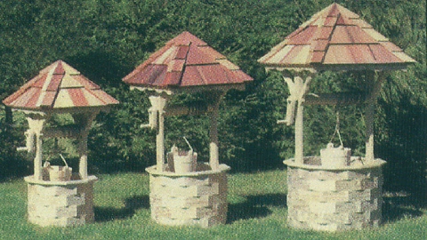

well well well..

然后新建个 objnet

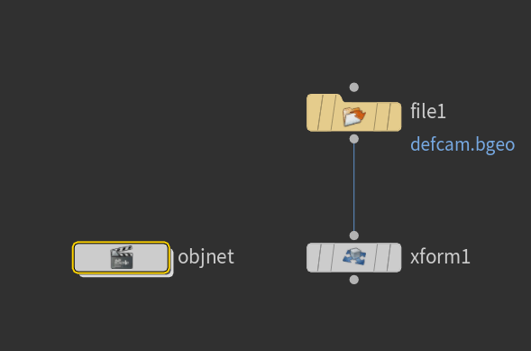

在 objnet 里面新建 geometry，一顿乱连 —— 


算好 view / projection 矩阵，把颜色记到 primitive 上面

BTW 由于没有必要把 z 值给弄到 0~1 区间或是 -1~1 区间，而且反过来 z 值变成非线性之后有些操作反而麻烦，所以 projection 这一步还可以自己发挥偷点懒


最后做一下深度排序，转换到 screen space, sRGB，输出：

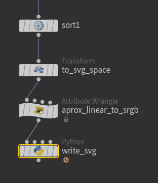


中间再加点菜 ——

## Backface Culling

在 Projection space，判断一下面法线的 z 方向就可以除掉 back face 了 ✓

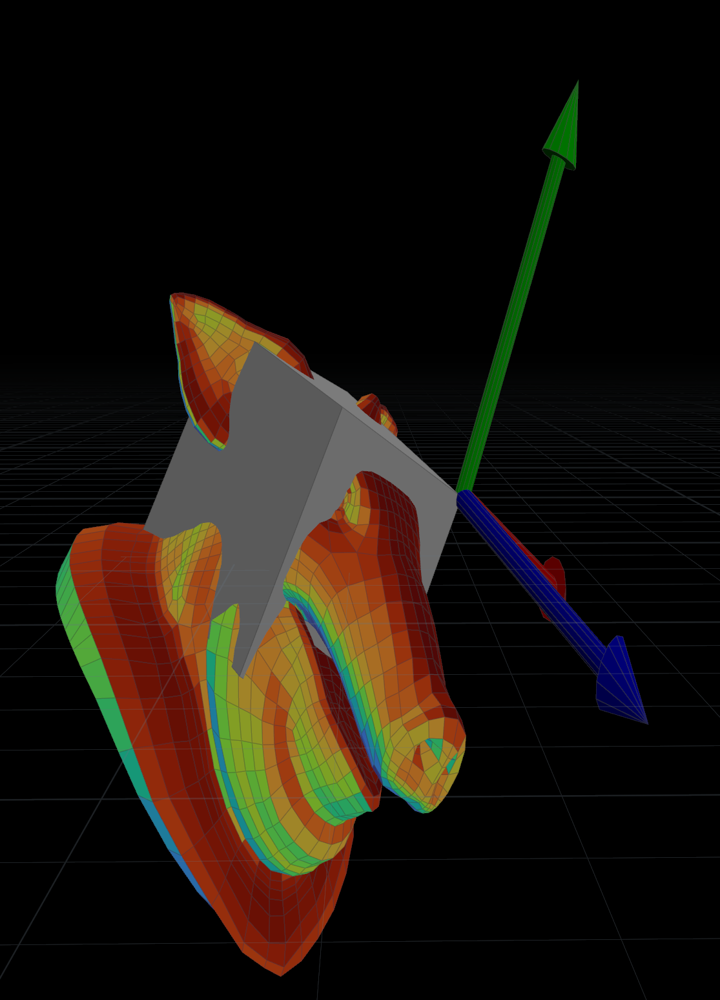

→

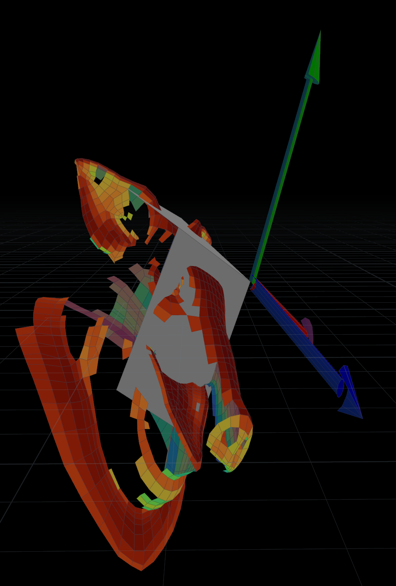

## Occlusion Culling

参考这篇 [ray tracing](https://zhuanlan.zhihu.com/p/69301910) 的做法，可以先光栅化一个 grid ，感光器每个点(像素)记录其投射到的 primnum，然后把不在记录中的 prim 给删掉 ——


此时沿 Z 轴观看：

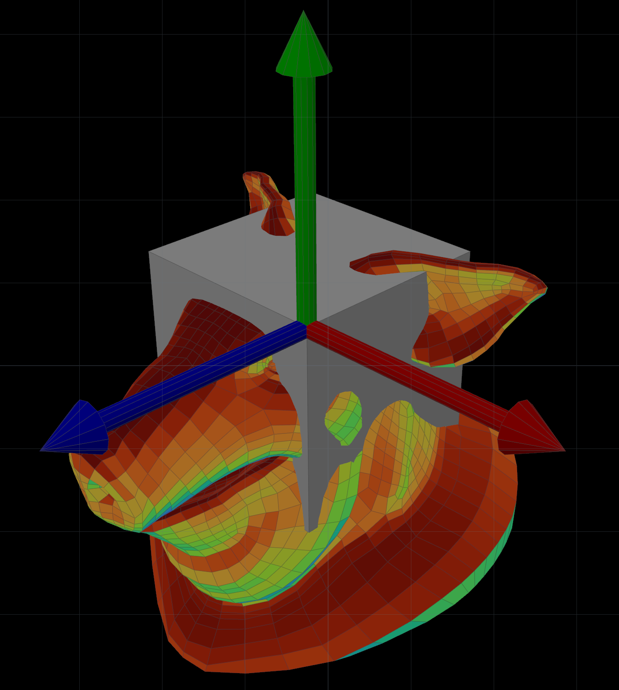

完全没毛病

BTW 如果有面积很小(亚像素)的多边形，可能需要超分辨率采样

## Depth Sorting

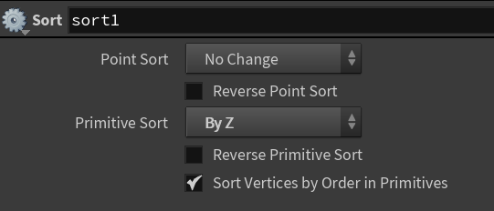

## Write SVG

随手写点 python 嘛

```python
pwd = hou.pwd()
geo = pwd.geometry()
resnode = pwd.node('../resolution')
camrootnode = pwd.node('../../..')

svg_fn = pwd.parm('svg').eval()
resx = resnode.parm('resx').eval()
resy = resnode.parm('resy').eval()
linewidth = camrootnode.parm('linewidth').eval()
from math import floor

def writepolys(svg):
  for pr in geo.prims():
    if isinstance(pr, hou.Face):
      coodstr = ''
      for pt in pr.points():
        coodstr += '{},{} '.format(pt.position().x(), pt.position().y())
      cd = pr.attribValue('Cd')
      cdstr = 'rgb({},{},{})'.format(int(cd[0]*255), int(cd[1]*255), int(cd[2]*255))
      if pr.isClosed():
        if geo.findPrimAttrib('width')!=None and pr.attribValue('width')>0:
          strokestr = 'stroke="{}" stroke-width="{}"'.format(cdstr, pr.attribValue('width'))
        else:
          strokestr = ''
        svg.write('<polygon points="{}" fill="{}" {}/>\n'.format(coodstr, cdstr, strokestr))
      else:
        width = pr.attribValue('width') if geo.findPrimAttrib('width')!=None and pr.attribValue('width')>0 else linewidth
        svg.write('<polyline points="{}" fill="none" stroke="{}" stroke-width="{}" />\n'.format(coodstr, cdstr, width))

def writesvg(svg):
  svg.write('<?xml version="1.0" standalone="no"?>\n')
  svg.write('<svg viewBox="0 0 {} {}" version="1.1" xmlns="http://www.w3.org/2000/svg">\n'.format(resx, resy))
  writepolys(svg)
  svg.write('</svg>\n')

if svg_fn!='':
  with open(svg_fn,'w') as svg:
    writesvg(svg)
```

好了，看看如何：


很明显，输出成 svg 之后丢了深度，所以这些相交的面没法自动得出遮挡关系了

怎么办捏

## Occlusion++

一个简单的思路是，在 geometry 输入的地方便先做一次 boolean 运算：

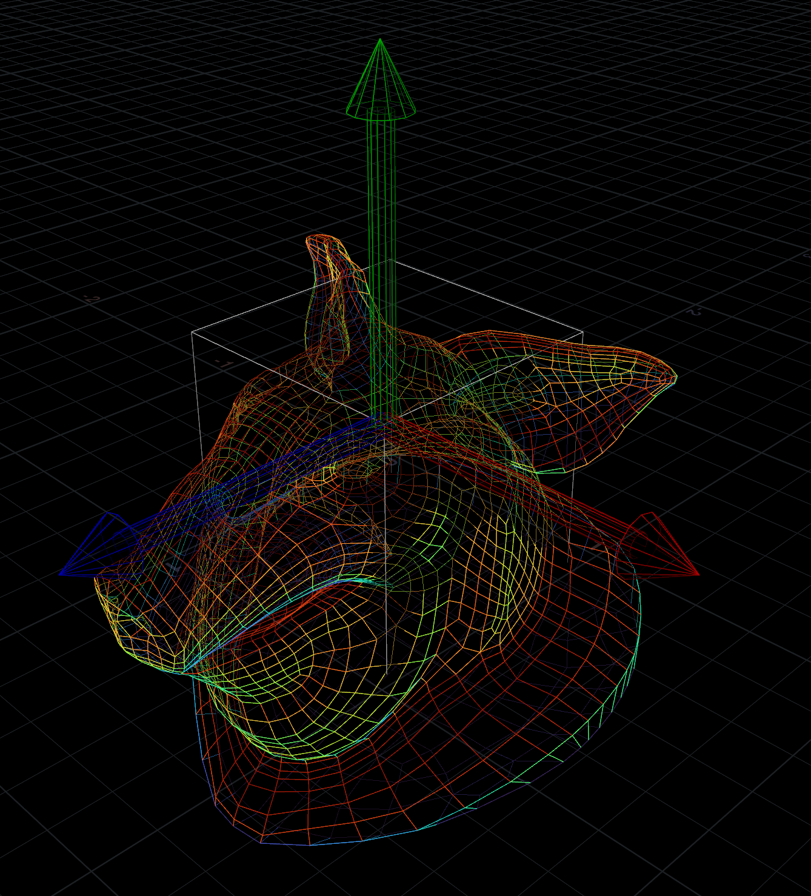

→

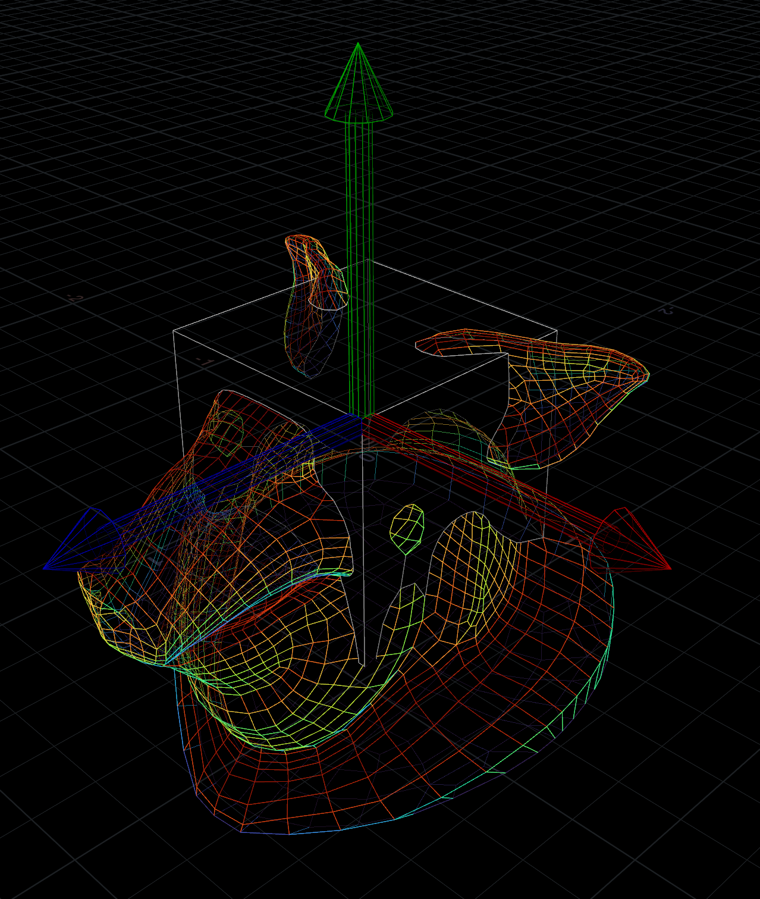

这样在 world space 便没了面相交的情况

输出看看：


better，但还是有深度错误

还有办法吗

如果能做到在 screen space 也没有相交的面就好了

## Occlusion++++

在 projection space 直接拉一个老长老长的投影出来 ——


然后做一下布尔运算，就得到了一堆在 z 轴向没有相交面的多边形了 ——

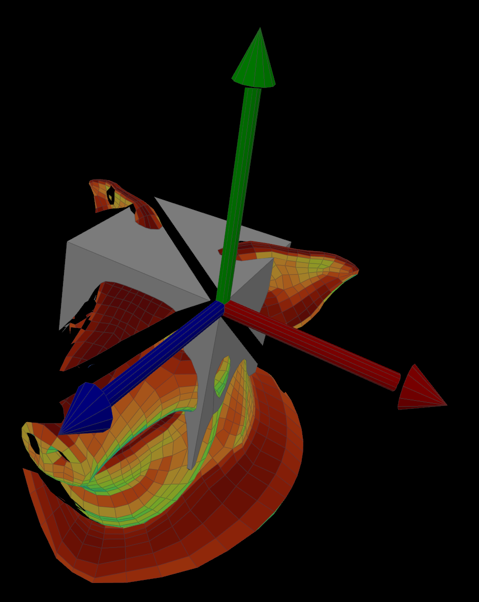


输出，便是完美的互不交叉的多边形了：


:D

## One More Thing

SVG 还有一点好，&lt;polygon&gt; 可以用 &lt;a&gt; 包起来，元素外观也可以用 css 自定义

所以，实际上 SVG 基本可以当作静态网页用了 —— 于是我就用 Houdini 渲染了我自己这 http://www.yuguo.me/ 整个主页

emmmm 路子虽野，但用起来感受很不错


## 声明

本文涉及技术均属业余时间原创，**不涉及**任何专利，**在同意所有衍生作品不得申请专利的前提下**请安心使用

