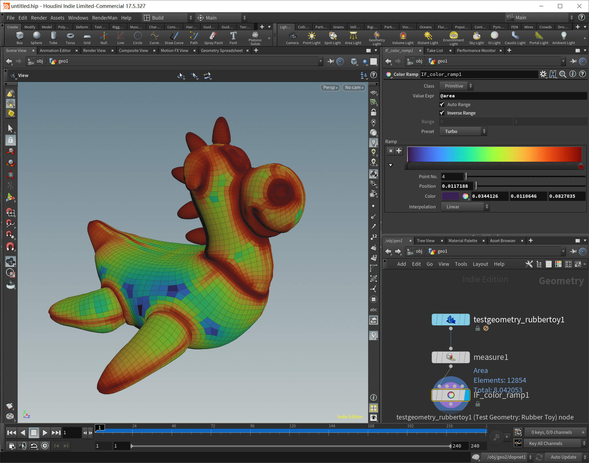

# The Missing Color Ramp Operator For Houdini

## 起因

在 Houdini 里面随手拉一个颜色渐变出来实在是太简单了，以至于从没把这个当作一件要在意的事情。

直到看到这个 —— [Turbo, An Improved Rainbow Colormap for Visualization](https://ai.googleblog.com/2019/08/turbo-improved-rainbow-colormap-for.html)

发现，选好渐变色还是挺有学问的

所以很想在 Houdini 里面也弄一个好用点的颜色可视化功能，功能上大概想要——

1. 有几个好看的预设
2. 可以自动确定值域
3. 可以直接写表达式

嗯……于是就折腾出了一个

## 能干啥

比如看看法线和某个向量的夹角

比如看看高度

比如看看面积

比如看看某个看似 float 其实是 string 的属性

比如看看哪块地方 Airbnb 的选择比较多

或者看看哪块地方酒吧比较密集

……

实际用下来感受不错，早点折腾出这个东西就好了

## HOW

### Like This

### 如何做预设

首先，我注意到 [MOPs](https://www.motionoperators.com) 的 fallout preview 功能可以选择 preset，那太好了，学(抄)啊！

* 新建 hda
* 在 Scripts 中添加 PythonModule
* Python Module 中添加 preset callback:
  
* 新建 presets 列表参数，设置 callback:  
  
* That's it
* 需要注意的是，无论前面提到的 turbo 还是[从 matplotlib 抄来的](https://github.com/matplotlib/matplotlib/blob/master/lib/matplotlib/_cm_listed.py)有名有姓的渐变色，它们都是 sRGB 空间的，得转换一下再用
* 还有个小窍门是可以用 [toolutils.createModuleFromSection](https://www.sidefx.com/docs/houdini/hom/hou/HDAModule.html) 引用 hda 内部嵌入的 python 文件作为 module:  
  

### 如何自动值域

easy:

### 如何执行表达式

also easy:

什么？这样写怕代码注入？能注入代码那不挺好嘛，反正搞挂 Houdini 又不差这一种办法...

需要注意的是 Evaluation Node Path 要设置成 `..`，否则若是在上一层添加了 sparse input 或是通过相对路径引用了什么其他的 geometry, 表达式到这儿上下文就不对了

## 所以哪里这么好的 Ramp 哪里有呢

这里：[IF_color_ramp.hdalc](https://drive.google.com/file/d/1bDfUAPhwgE36blzBz-LrmgOw8wH_3p-h/view?usp=sharing)