# 程序猿 Houdini 启蒙

_写这文章是因为最近被项目所逼入了 Houdini 的坑, 然后越用越觉得这个太好玩了；虽然通常被认为是美术工具，但是 Houdini 从理念到操作到具体功能的设计都对程序猿非常友好，希望此文能吸引更多同好一起来玩，一起创造些有趣又酷炫的东西_

_顺便希望吸引同组的小伙伴入坑之后能一起分担点工作 ; )_

_欢迎勾搭，欢迎指点_

## 建模工具千千万，为何独选 Houdini？

### 首先因为 Houdini 真的与众不同

—— 尤其是 _/\*在我看来\*/_ 特别适合程序猿，甚至 Houdini 这软件的定义就应该是一个“图形编程环境”。

Houdini 最大的特点在于其“程序化”（Procedural）理念，其创作流程不同于一般的建模或动效工具，相对于“通过一堆神奇的操作做出了一个漂亮对模型/实现了一个神奇的效果”，在 Houdini 里面创作的是 “一堆神奇的操作”本身，对于程序猿来说，这就是个典型的 function，而 function 的意义在于，它可以用同样的流程处理不同的数据。

例如我可以用一个底面拉出一个带房顶的简单房子：

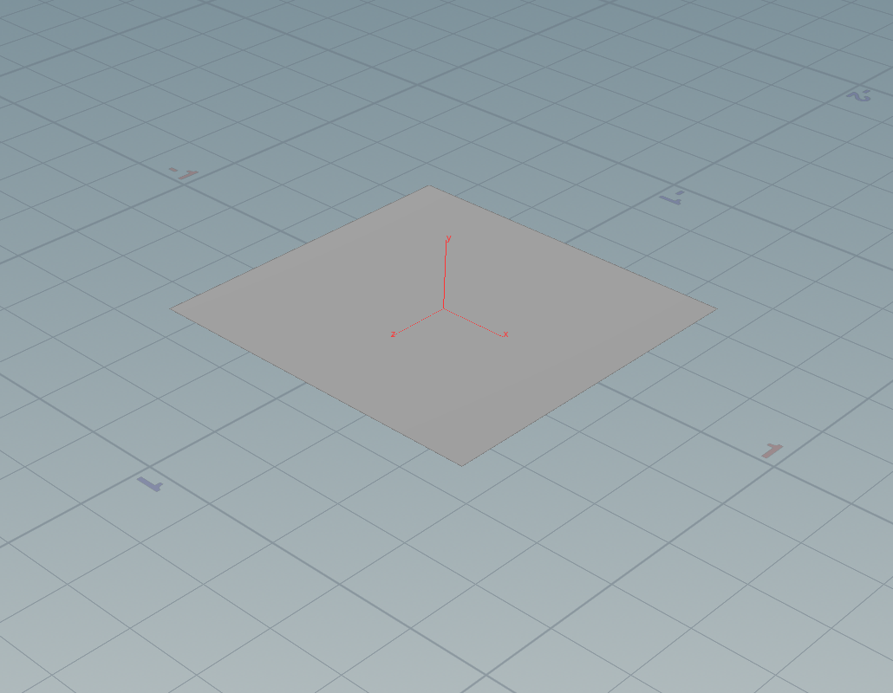

→

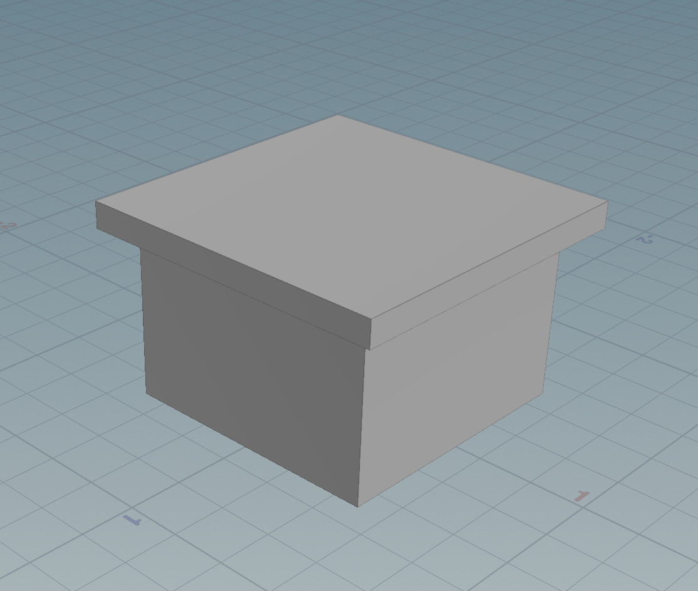

那么我就可以将同样的流程用于其他的输入参数 ，例如将两个字母拉成带房顶的字母——

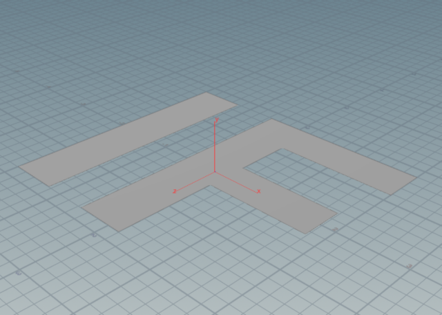

→

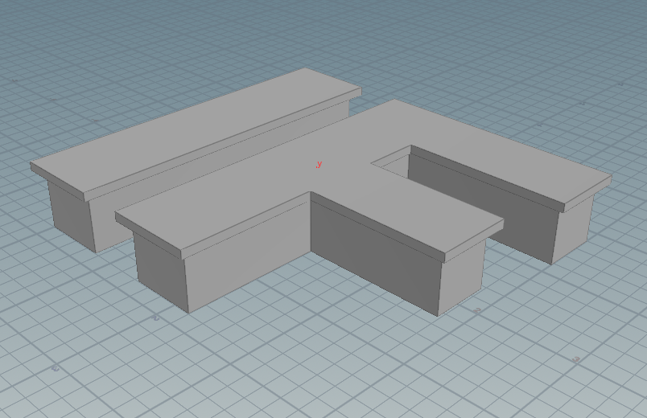

将“建模”看作“数据处理”，逻辑上合情合理，效果上则是大量重复劳动的节省，对于建 n 个相似模型的需求，可以将 O(n) 的时间复杂度直接降到 O(1)，请想象一下

### 其次因为 Houdini 强得吓人

有些效果用其他的工具根本难以做到，拿我有段时间的头像举个简单的栗子：

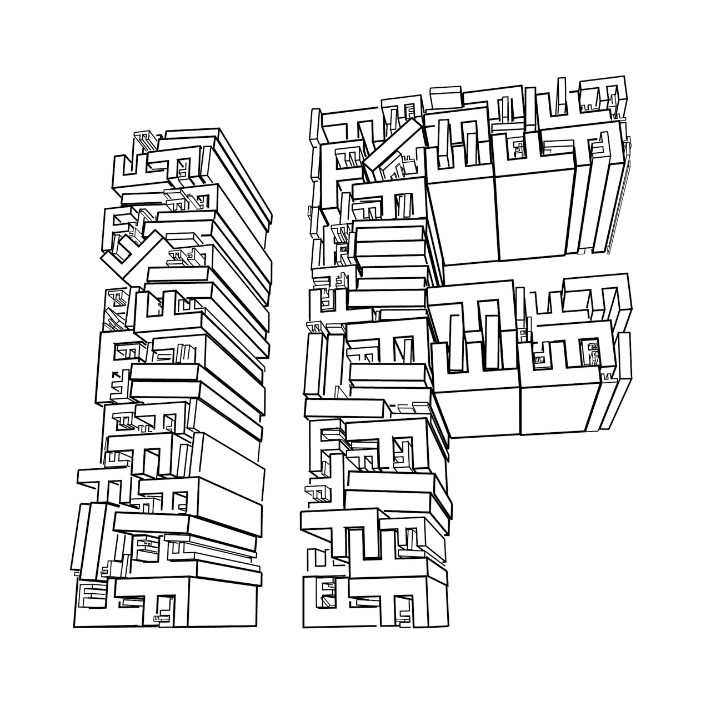

把几何物体尽可能紧密地排布在指定区域，将相机视角看到的线段输出成矢量图形，根据大小关系决定线条粗细

—— 开发这样的功能在别的工具那儿不深入底层搅个底朝天我想不到有什么直接的办法

在 Houdini 这一边呢，日常操作完全可以满足：

1. 用 uvlayout 功能排布几何物体 // 吐槽：Houdini 的 uvlayout 算法简直无敌
2. 在相机前绑定一个平面
3. 用 resample 功能将每个线分成很多个点
4. 写段代码用 rayhittest 函数或 intersect 函数判断遮挡关系，顺便删除被遮挡的点
5. 写段代码把在一条直线上首尾端点以外的点都删掉
6. 用 ray 节点将剩下的点都投影到第2步绑定的平面上
7. 通过相机逆矩阵将空间平面转换到 xy 平面
8. 查一下 svg 格式文档，写段代码输出 svg

// 没错，“写段代码”在 Houdini 的世界里是日常操作

Pyro、VDB、PBD、FLIPS、体素操作+OpenCL、集群 这些更是 Houdini 的专长，拿出来和别人比简直欺负人，没有能还手的，干脆不说了

顺便拿 Houdini 最近两个版本的 changelog 来看看：

[16.0](https://www.bilibili.com/video/av8430681)

[17.0](https://www.bilibili.com/video/av32562710)

厉害不厉害？

### 还因为 Houdini 有为实时渲染留一条路

Houdini 没有只顾着自己浪，它还为我们做实时渲染的小伙伴铺好了路 ——

网格物体无论经过多复杂的计算过程，其最终结果至少可以通过 Alembic 格式输出成顶点动画，SDK 给你，Unreal 和 Unity 都认

这还不够，基于顶点的动画还可以自动绑定骨骼，将模拟结果转换为骨骼动画，这下谁都能认了

这还不够，多亏自由的shading系统，它还可以将顶点动画输出到贴图中，使得用 GPU 驱动顶点动画成为可能，这下根本没有CPU代价了 [参考](https://vimeo.com/207832662)

这还不够，它可以自动做 LOD，自动生成 imposter，自动生成 texture sheet [参考](https://www.sidefx.com/tutorials/generating-impostor-textures/)

Texture sheet 还不够，它还可以将 motion vector 输出到 texture sheet，让 flipbook 也可以在两帧之间做插值 [参考](http://www.klemenlozar.com/frame-blending-with-motion-vectors/)

Houdini 作为一个图形编程环境，自由度之高只有想象力限制，甚至纯 CPU 渲染第一次也显得如此可爱了


## 如何着手学习 Houdini

吹了半天，那么如何开始呢

我个人的学习方式是 ——

1. 随便找个视频了解基本视图操作
2. 看文档了解基本几何操作
3. 自己试着做些有趣的效果 // 隔三差五换头像 …… 被吐槽死
4. 被自己想做的效果逼着了解更多的几何操作方法、技巧，然后开始学习 vex 和 hython
5. 看 entagma 学习更高级一点的技巧，顺便构思下一个效果想做什么
6. 将学到的技术用在实际项目中
7. 回到第三步

—— 我觉得效果还不错

下载安装这些事情我就略过了，相信读者肯定搞得定；顺便提一下用来练习或是做个人作品的话，免费的 Apprentice 版本是够用的；而且虽说 Apprentice 版本禁用了 fbx/abc/gltf 这些格式的导出，但以 obj 格式是可以导出几何物体的，相当公道了，请手下留情支持正版

接下来我将试着将 1、2 两步总结一下带你快速入门，剩下的就看造化啦

## Houdini 基本界面操作

打开 Houdini，你看到的界面应该大致如下，一共分了三大块：

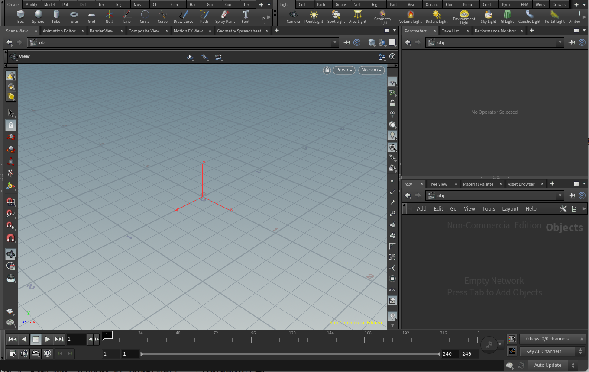

1. 左边的一大块是 3D 预览界面，和一般DCC软件不一样的是，在这个 3D 界面中你真的只需要“看”，不需要执行任何操作 —— 即使可以执行操作，我也不推荐，在这里执行的操作多半会破坏程序化处理流程
2. 右上方是属性界面
3. 右下方是节点编辑界面，你的主要操作都会在这儿进行

### 3D 预览界面的基础操作

先确定选中左边工具条的查看模式 // `ESC` 键

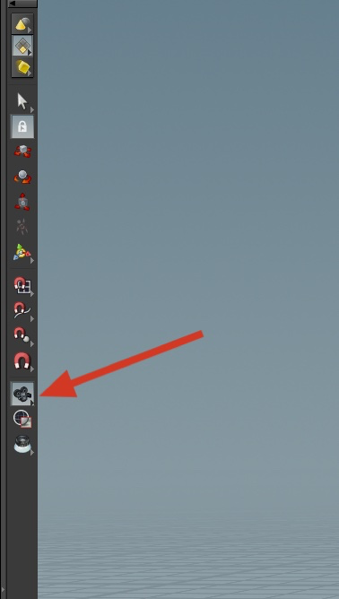

* 按住左键拖动鼠标 → 旋转视图
* 按住中键拖动鼠标 → 拖动视图
* 按住右键拖动鼠标 → 缩放视图

`G` 键  → 查看选定物体

`A` 键 → 查看所有物体

别的你可以慢慢研究 (在 3D 视图中点右键，会有一些常用操作以及快捷键提示)，但一时半会知道这些就够用了

### 属性界面的基础操作

* 对于数值框，按住鼠标中键拖动可以享受世界上最棒的滑动条
* 参数嘛，填就是了
* 你还可以自己加参数，这个后面再说

### 节点编辑界面的基础操作

* `Tab` 键调出节点列表，输入节点名称可以插入节点
* 导航操作和 3D 界面一样

_下一步之前，你可以先操作一下练练手_


## Houdini 的基本几何操作

### Hello Cosine

进入正题，我来手把手教你如何用 Houdini 画出 `y = cos(x) + cos(z)` 的函数图像 : )

首先在 Houdini 的节点界面敲 `Tab` 键，然后输入“geo”


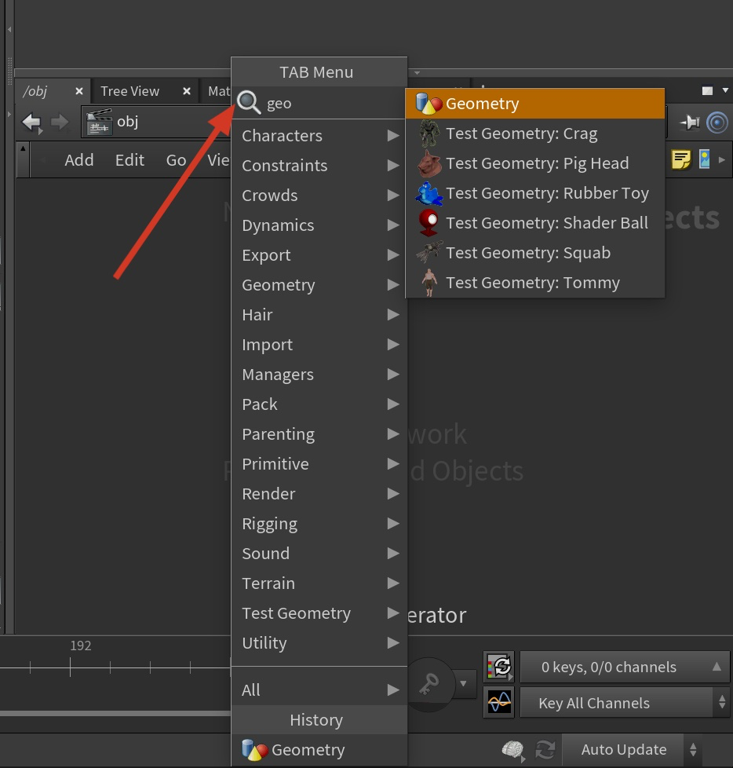

回车，即加入了新的 geometry；之所以有这一步，是因为 Houdini 能做的东西不止 geometry，geometry 也可以有不止一个。


接下来的操作都将在 geometry 节点下面进行：

双击 `geo1` 节点进入其内部

如果你用的 Houdini 是 17.0 以前的版本，这里应该有个 `file` 节点，而左侧 3D 界面应该有个方块，没事，我们把这个 `file` 节点删掉；17.0 之后则没有这个默认的磨人的小方块了

以同样的方式按 `Tab` 键，输入“grid”添加一个 grid 节点

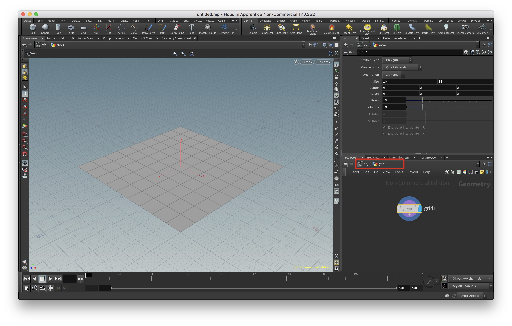

现在右上角的属性面板里出现了这个网格的属性，包括位置、大小、行列数等，你可以试着改改看

右下角 `grid1` 节点右侧点亮了一个蓝色小标记；这个标记代表当前显示节点，不妨试试将它点灭掉，3D界面中的网格也将消失（记得点亮回来）

另外还有几个标记，分别是略过此步操作、冻结该节点以及将当前节点用作模版的意思，暂且忽略 —— 实在好奇请看这里 [Geometry nodes](http://www.sidefx.com/docs/houdini/nodes/sop/)

先来解答程序猿最关心的问题： **代码写在哪？**

* 我们再通过 `Tab` 输入 att wangle 加入一个 Attribute Wangle 节点
* 将 `grid1` 下面的小点和 `attribwangle1` 上面的第一个小点连起来，并点亮显示标记：  
  
    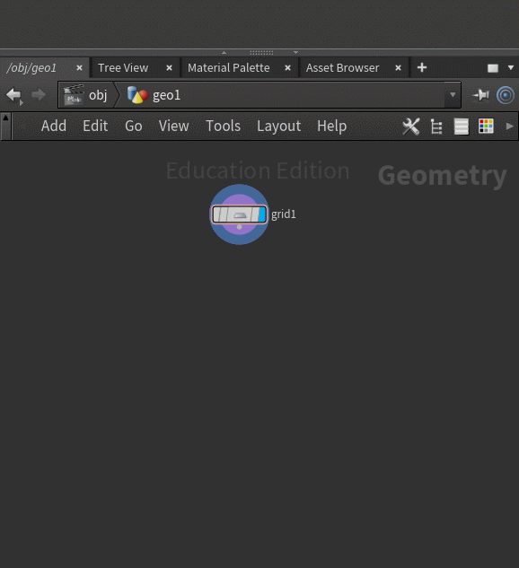  
    
* 选中 `atttribwangle1`，在属性面板上找到如下图的代码框，输入：

    ```vex
    @P.y = cos(@P.x)+cos(@P.z);
    ```

    `Ctrl+Enter`, 你将得到如下图的结果

    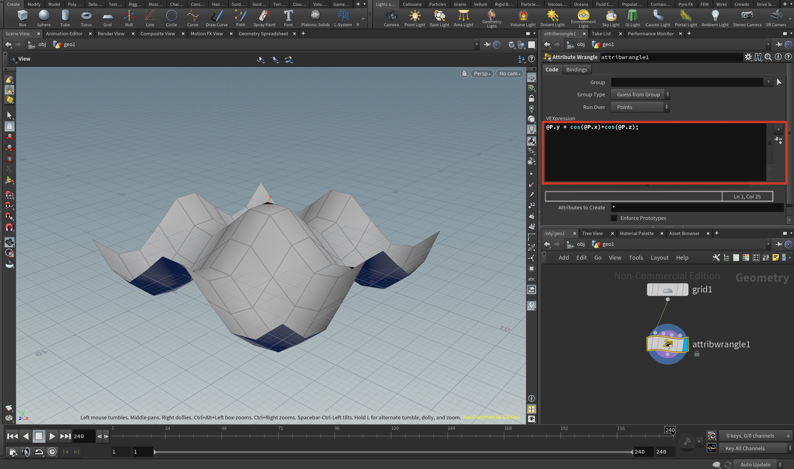


这里有几个知识点：

1. 一个节点上方的小圆点代表这个节点的输入，而下方的小圆点代表的是这个节点的输出
2. 一个节点的输入连到另一个节点的输出，这便形成了一个流程图；在 Houdini 中，这个流程图便是一切
3. 在 attribute wangle 节点中写的语言名叫 vex，Houdini 对 vex 的介绍如下：  

      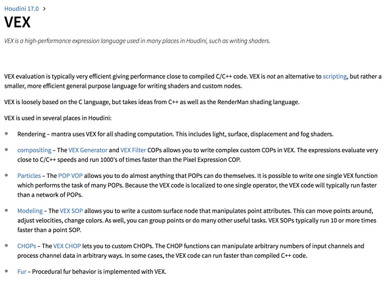    
      
      对 vex 抱有兴趣的小伙伴可以在这里看更多相关资料：[VEX language reference](http://www.sidefx.com/docs/houdini/vex/lang.html) 或是这个[非常棒的参考](https://github.com/jtomori/vex_tutorial)
4. attribute wangle 节点的作用是，用指定代码段处理第一个输入参数并将结果输出
5. 比较值得一提的是代码中的 `@P`:

      `@property` 是 vex 中访问属性的语法，`P` 是最重要的属性：坐标
      
      所以上面那句话的意义就是 `position.y = cos(position.x)+cos(position.z)`
      
      注意 attribute wangle 节点上的这个选项：
      
      
      
      其默认值是“points”，也就是 **对于每个点执行一次** `@P.y = cos(@P.x)+cos(@P.z);` 操作，这正是我们想要的；attribute wangle 还可以用来处理其他数据，以后我们也会用到

现在还有个小问题：这个函数图像似乎太不光滑了：

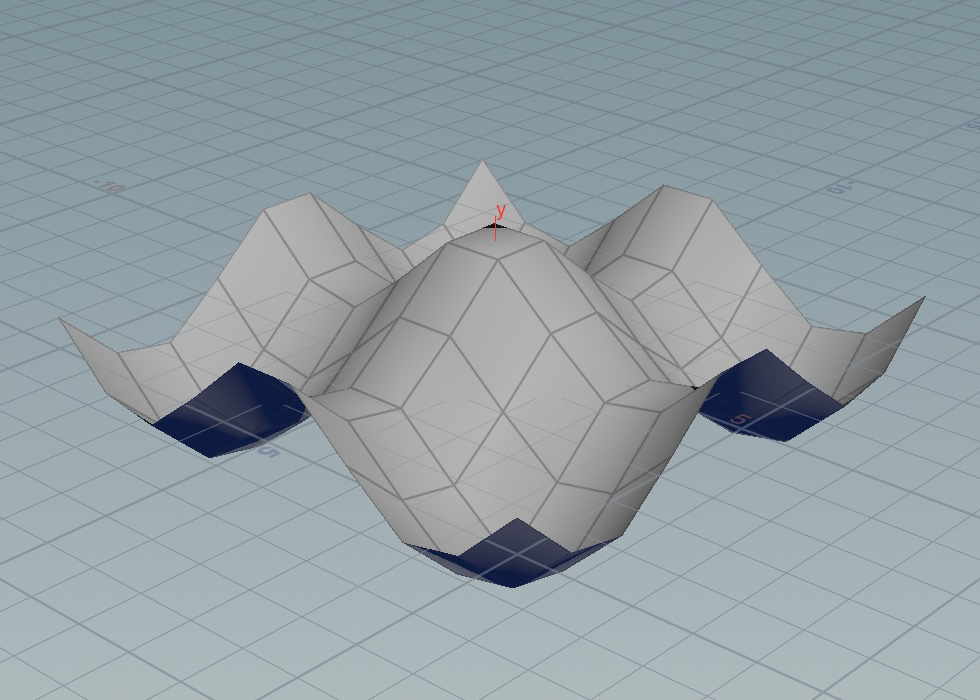

怎么办呢，我们选中 `grid1` 节点，此时属性界面会再次显示 `grid1` 节点的属性，我们将行列数都改到 100：

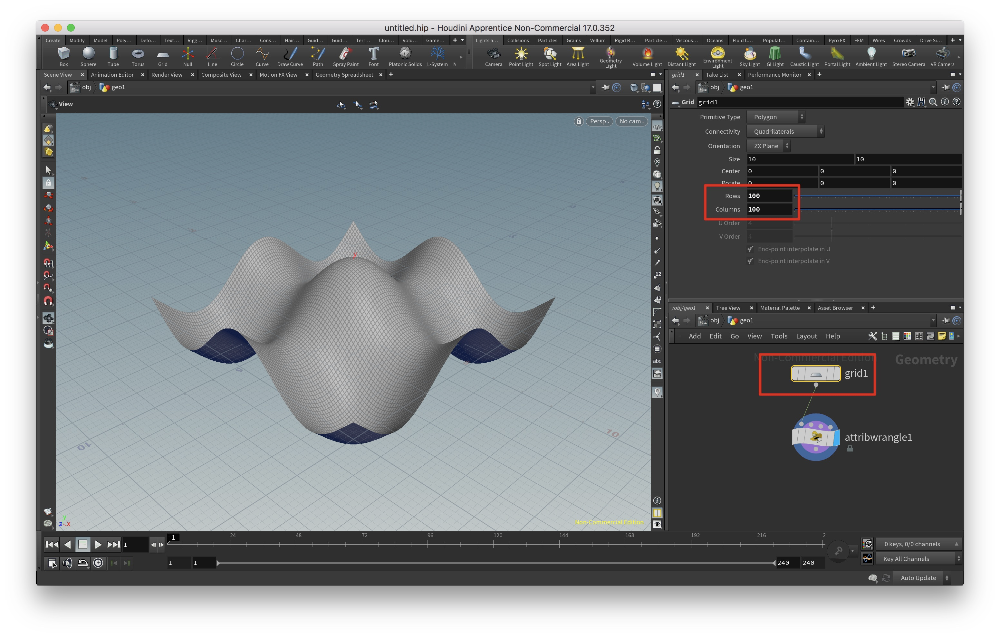

现在我们得到了 一个光滑的 `y = cos(x)+cos(z)` 函数的曲面 : )  由于每一步操作都有据可依，所以输入改变了输出完全可以适应着变化，不必从头来过

当然，我们还可以完全把 grid 这个输入换掉，比如换成几个字母：

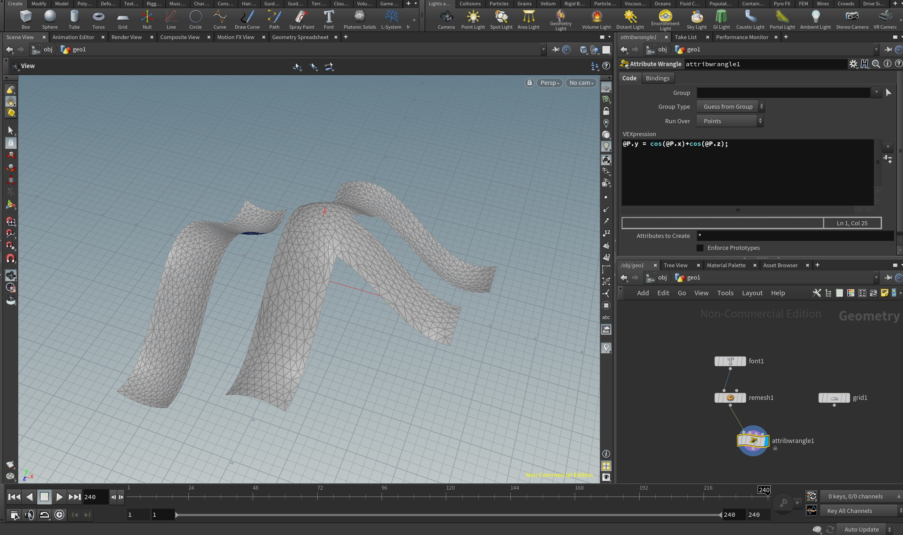

此时的 Houdini 有没有魅力四射？


### Channel

在 Houdini 里面，"Channel" 是个很重要的概念；在属性界面填的属性都是 "Channel"，鼠标移到属性名上可以看到其 channel 名称：

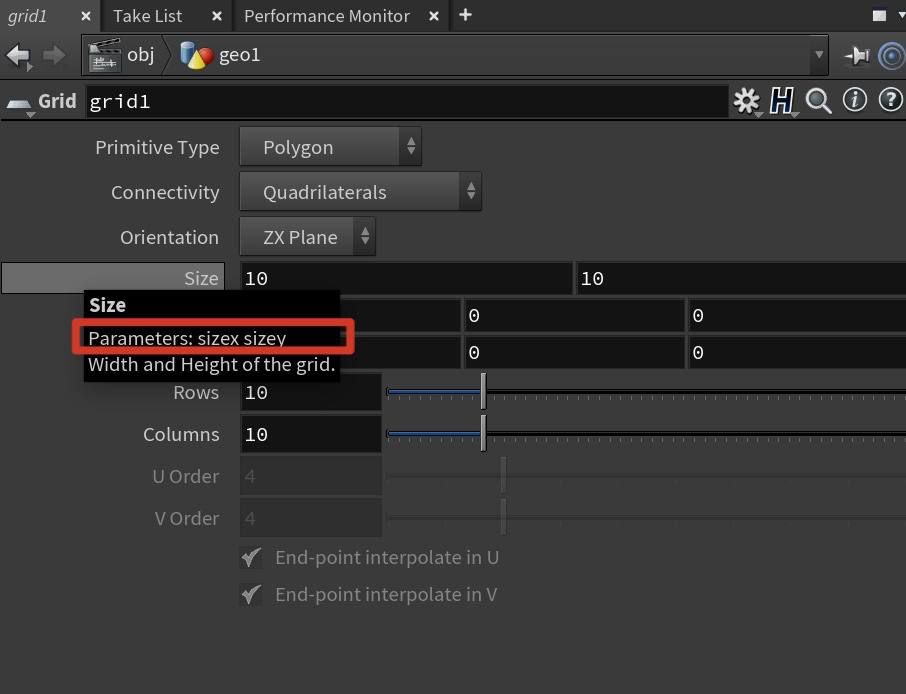

这个名字配上 `ch('path/to/channel')` 函数可以用于在节点内或者节点之间互相引用参数 —— 比如我可以在 sizey 的栏中填入 `ch('sizex')`:

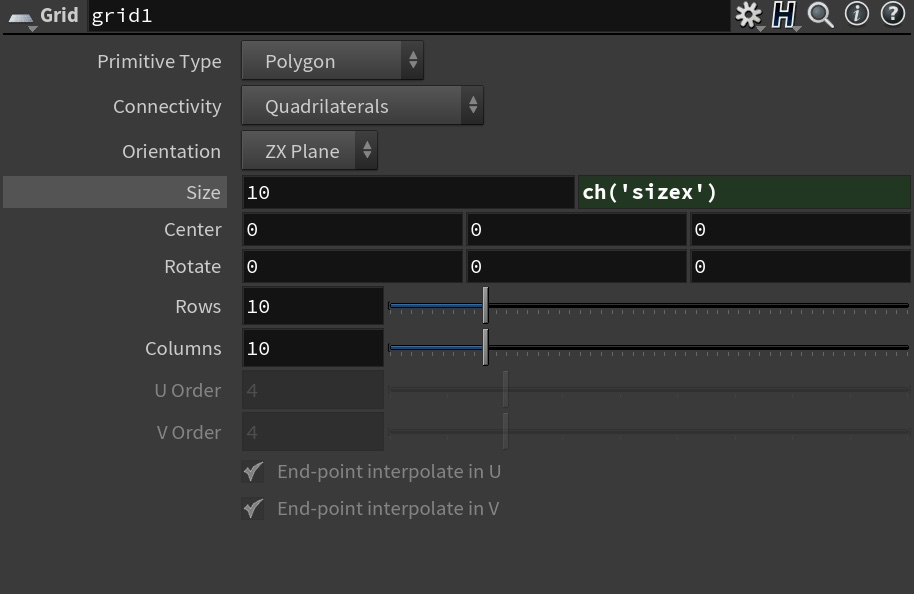

嗯没错，每个参数栏都不仅可以填常数，也可以填表达式

我们左键再点击一下目前浅灰色的 Size 标签，`sizey` 将会以数值显示：

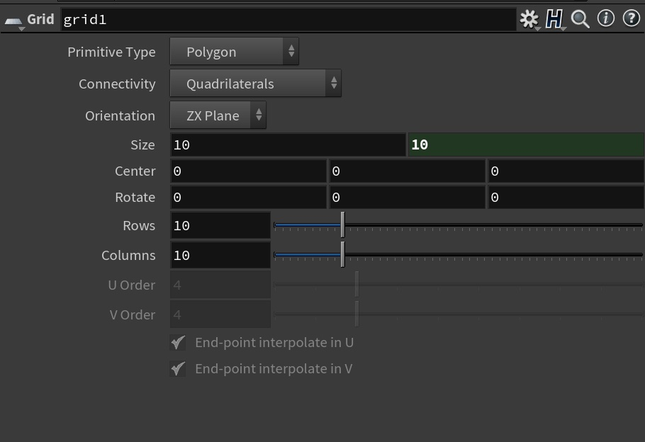

试着改改 `sizex`，`sizey` 的值将永远保持与 `sizex` 相等，现在这个 grid 生成的也就总是正方形了

更重要的是 channel 还可以在节点之间互相引用，比如这样可以在场景内放入两个立方体：

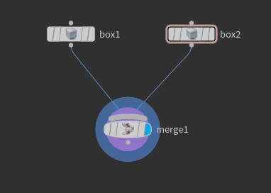

目前两个立方体显然是叠在一起的：

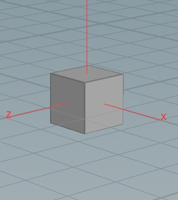

但如果在 box2 的 center y 坐标 `ty` 栏中填入 `ch('sizey')*ch('scale')/2+ch('../box1/ty')+ch('../box1/sizey')*ch('../box1/scale')/2`

我们就可以把 box2 放在 box1 上方了：

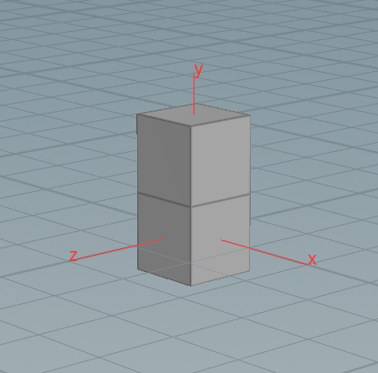

这里 box2 通过  `ch('../box1/sizey')` 访问到了 box1 的高度属性，通过 `ch('../box1/ty')` 访问到了 box1 的 y 坐标，通过 `ch('../box1/scale')` 访问到了 box1 的缩放

可是本来输入 1 就可以了，为什么要这么麻烦？？

—— 因为这样写的话，box2 可以保持永远严格贴在 box1 上面：

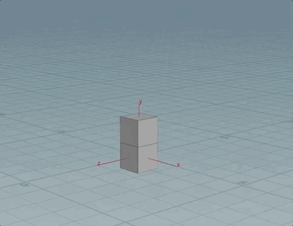

#### 加个参数

在 Houdini 中，不光内置的参数可以用 `ch()` 函数引用，你还可以轻易的自己加些参数；在 attribute wangle 节点中添加 channel 尤其简单：

直接引用 channel 数据，比如：

```vex
float height_scale = ch('height_scale');
```

然后点一下代码框旁边的这个小按钮：

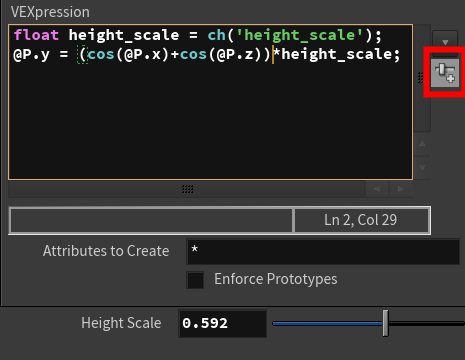

滑动条便会出现：

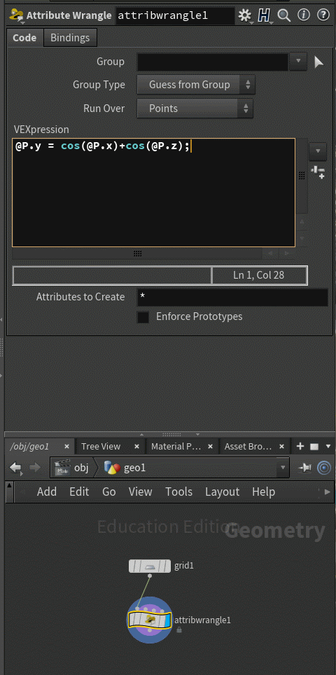

然后拖动滑块便可以见证奇迹了 ——

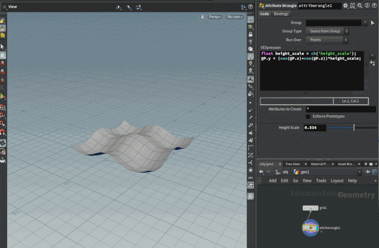

#### What About int/string/vector/matrix?

看文档啦 [ch VEX function](http://www.sidefx.com/docs/houdini/vex/functions/ch.html)

### VOP

vop 节点和 wangle 节点其实是一样的功能，区别在于用的是节点化的表示，以前面那段代码为例：

```vex
@P.y = cos(@P.x)+cos(@P.z);
```

我们也可以通过添加 attribute vop 节点如此实现：

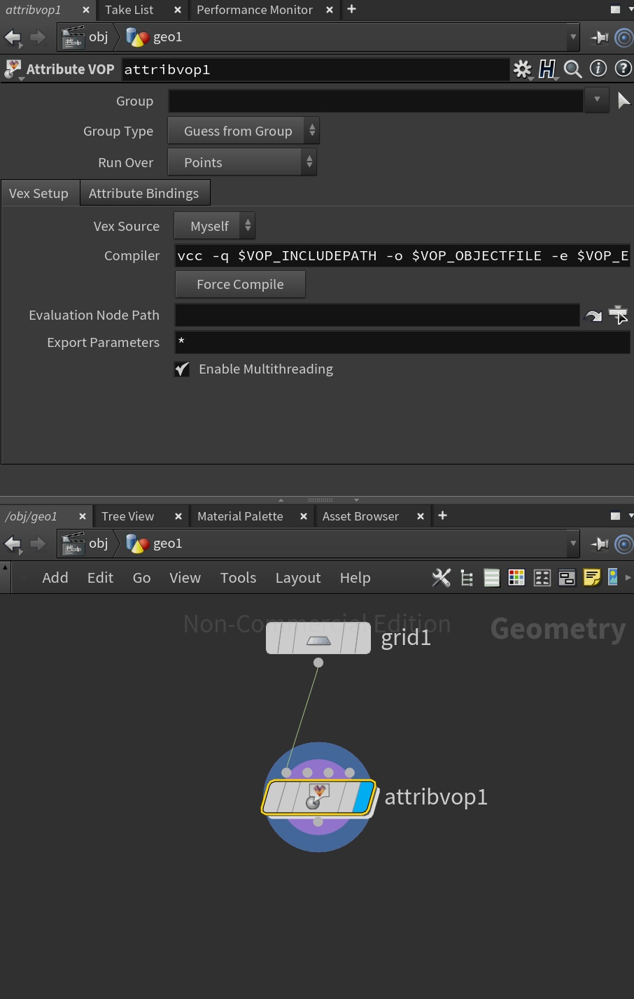

然后双击进入 attribvop1 节点：

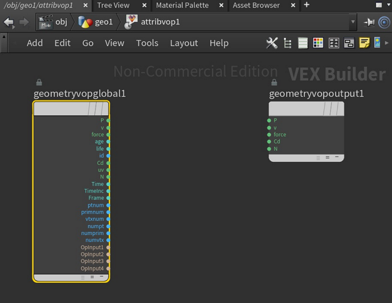

左边一栏是输入属性，右边一栏是输出属性 —— 这里没列出来的属性也可以用 `bind` 或 `bind export` 节点输入/输出

要实现和 `@P.y = cos(@P.x)+cos(@P.z);` 等价的操作，我们可以这样连接：

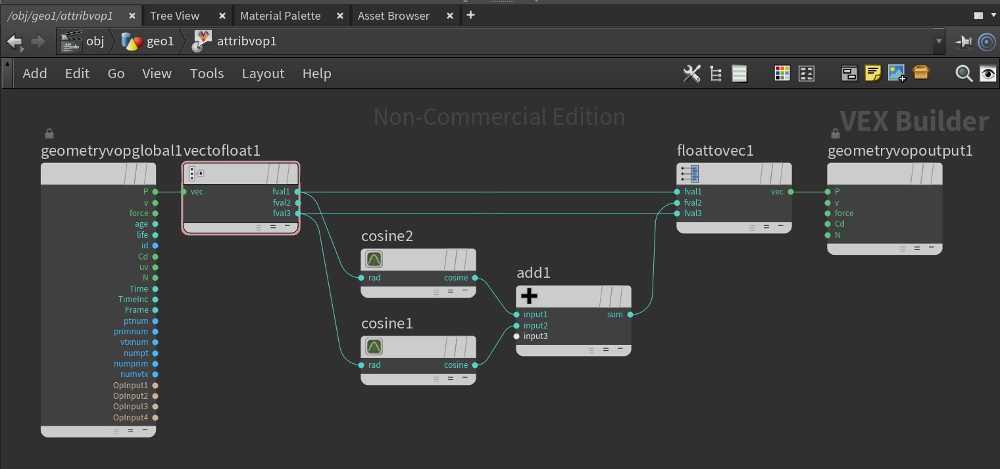

作为程序猿，对于这种看上去非常冗长的表示可能有点抗拒？

但 vop 的好处很明显：在函数记不清的情况下，这里能提供的自动补全要方便些 : )

### 总结一下下

* Houdini 提供了一套流程化的 Geometry 处理方法
* 目前为止提到过的操作都属于 Geometry 处理的范畴，记得先建一个 geometry 节点
* 我们可以用 attribute wangle 或者 attribute vop 方式操作 geometry 属性
* 坐标属性是 `@P`, 其他常用属性请看文档：[Geometry attributes](http://www.sidefx.com/docs/houdini/model/attributes.html) // 顺便请仔细读 vertex / point / primitive / detail 属性的意义和关系
* Geometry Spreadsheet 是个非常重要的界面，这里没讲，因为一看就懂，但一定要看一眼！  

    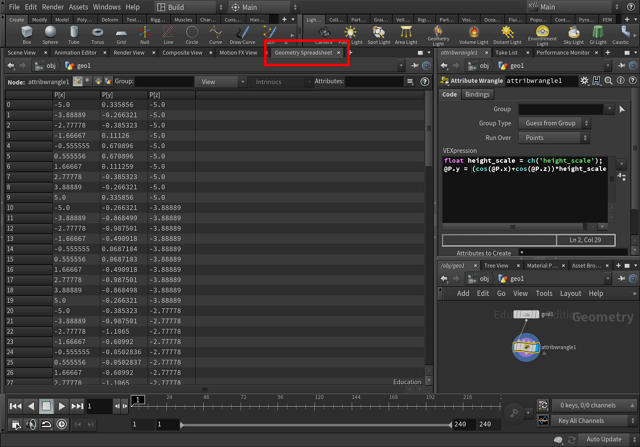
* 我们可以用 `ch('path/to/channel')` 的方式读取节点参数，还可以自己多建几个参数
* 如果你对 attribute 和 channel 犯迷糊的话 —— attribute 数据是一直跟随着 geometry 传递的，而 channel 数据只在对应的节点上


### 给程序猿的顺带一提

*既然这入门是写给程序猿的，可以顺便一提，Houdini 的 node graph 与其理解为 a→b→c 的流程图，其实理解为 c(b(a())) 的函数表示更为妥当；这样的思维转化能够让你后面能更好的理解 `switch` 为什么在控制流程的下游、`for` 循环的控制为什么在下游，以及 dopnet 的工作原理*


## 接下来玩什么

知道基础操作和基本概念之后，剩下的基本就是玩了，边玩可以边看文档：

* 几何操作节点 [Geometry nodes](http://www.sidefx.com/docs/houdini/nodes/sop/)
* vex 函数 [VEX Functions](http://www.sidefx.com/docs/houdini/vex/functions/index.html)

知道了以上这些，至少可以做出些魔性的 pattern 玩了 ——

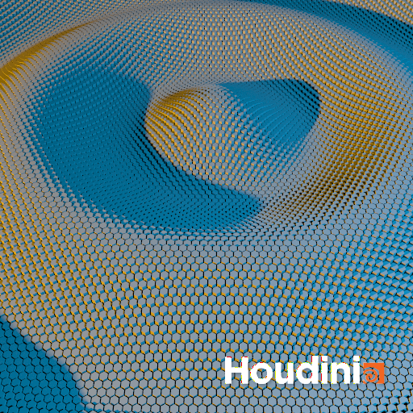  

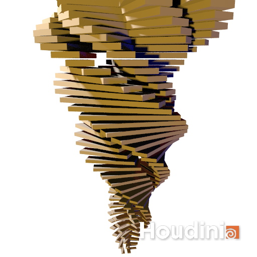


## 接下来讲什么

可能讲讲流程控制、分组、可能整理些小技巧，随缘咯


## 接下来看什么

强烈推荐 [entagma](http://www.entagma.com/)，非常 inspiring


## P.S.

因为实在不知道下一篇什么时候有兴趣写，所以这一篇写得长了点，但愿能引你进门吧

## P.P.S.

缺人，求贤若渴

蚂蚁金服，图形与艺术实验室，缺程序缺美术缺TA，都缺，快来
